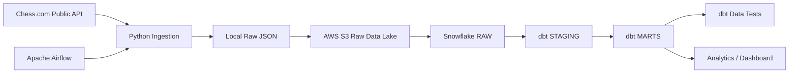
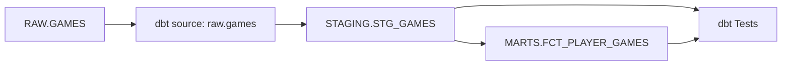

# PlayerPulse

> End-to-end cloud data engineering and analytics pipeline using Python, Apache Airflow, AWS S3, Snowflake, dbt, Docker, and the Chess.com Public API.

PlayerPulse is a portfolio data engineering project designed to demonstrate how data moves through a modern analytics stack — from an external API to raw cloud storage, into a data warehouse, through tested transformation layers, and eventually into analytics-ready models.

The project is intentionally built so that the architecture can be reused as a template for other API-based data pipelines.

---

## Table of Contents

- [Project Overview](#project-overview)
- [Current Project Status](#current-project-status)
- [Architecture](#architecture)
- [Technology Stack](#technology-stack)
- [Component Responsibilities](#component-responsibilities)
- [End-to-End Data Flow](#end-to-end-data-flow)
- [Repository Structure](#repository-structure)
- [Source Data](#source-data)
- [Python Ingestion Layer](#python-ingestion-layer)
- [Local Data Processing](#local-data-processing)
- [Apache Airflow Orchestration](#apache-airflow-orchestration)
- [AWS S3 Raw Data Lake](#aws-s3-raw-data-lake)
- [AWS Security Model](#aws-security-model)
- [Snowflake Warehouse](#snowflake-warehouse)
- [Snowflake Raw Loading](#snowflake-raw-loading)
- [dbt Transformation Layer](#dbt-transformation-layer)
- [Data Quality Testing](#data-quality-testing)
- [Idempotency](#idempotency)
- [Docker Environment](#docker-environment)
- [Configuration and Secrets](#configuration-and-secrets)
- [Local Setup](#local-setup)
- [Running the Pipeline](#running-the-pipeline)
- [Verifying the Pipeline](#verifying-the-pipeline)
- [Using This Repository as a Template](#using-this-repository-as-a-template)
- [Design Decisions](#design-decisions)
- [Current Limitations](#current-limitations)
- [Production Improvements](#production-improvements)
- [Troubleshooting](#troubleshooting)
- [Roadmap](#roadmap)
- [What I Learned](#what-i-learned)

---

# Project Overview

PlayerPulse processes public Chess.com game data through a complete analytics engineering workflow.

The pipeline currently:

1. calls the Chess.com Public API;
2. discovers available monthly game archives;
3. downloads raw JSON files;
4. performs local Python transformations;
5. orchestrates execution with Apache Airflow;
6. uploads raw archives to AWS S3;
7. loads the files into Snowflake;
8. preserves semi-structured JSON in the RAW layer;
9. transforms data using dbt;
10. builds analytics-ready MART models;
11. runs automated data quality tests.

The goal is not simply to create a chess dashboard.

The primary objective is to understand and demonstrate the responsibilities and interactions of the major components in a modern cloud data platform.

---

# Current Project Status

The full pipeline has successfully executed end-to-end through Apache Airflow.

Current sample data:

| Metric | Value |
|---|---:|
| Player | `ajaza` |
| Monthly archives discovered | 3 |
| Raw games loaded | 10 |
| Unique game IDs | 10 |
| dbt models | 2 |
| dbt tests | 19 |
| dbt test failures | 0 |
| End-to-end Airflow status | Success |

Current archive distribution:

| Archive | Games |
|---|---:|
| 2018-11 | 4 |
| 2026-01 | 1 |
| 2026-03 | 5 |

The dataset is deliberately small. The engineering architecture, automation, security decisions, reproducibility, and data modeling are the main focus of the project.

---

# Architecture



The actual Airflow DAG currently executes:

```text
fetch_player_profile
        ↓
fetch_player_games
        ↓
transform_all_games
        ↓
upload_games_to_s3
        ↓
load_snowflake_raw
        ↓
dbt_build
```

This separation is intentional.

The architecture diagram explains **which technologies are responsible for which parts of the system**.

The Airflow DAG explains **the actual execution order**.

---

# Technology Stack

| Technology | Purpose |
|---|---|
| Python | API ingestion, file processing, AWS/Snowflake integration |
| SQL | Analytical transformations |
| Chess.com Public API | Source system |
| Apache Airflow 3 | Workflow orchestration |
| Docker / Docker Compose | Reproducible local environment |
| AWS S3 | Raw object storage |
| AWS IAM | Access control |
| Snowflake | Cloud analytical warehouse |
| dbt Core | SQL transformation framework |
| dbt-snowflake | Snowflake adapter for dbt |
| Git | Version control |
| GitHub | Source repository and portfolio |
| JSON | Raw API format |
| JSONL | Local flattened intermediate format |

---

# Component Responsibilities

One of the main goals of PlayerPulse is understanding where the responsibility of one tool ends and another begins.

| Component | Responsibility |
|---|---|
| Chess.com API | Exposes public source data |
| Python | Retrieves and processes data |
| Airflow | Controls execution order, retries, and task state |
| Docker | Defines reproducible runtime environments |
| S3 | Stores raw source files |
| IAM | Controls AWS permissions |
| Snowflake | Stores and queries analytical data |
| dbt | Builds tested SQL transformation models |
| Git | Tracks source-code history |
| GitHub | Publishes and documents the project |

For example:

Airflow does **not** replace Python.

Snowflake does **not** replace S3.

dbt does **not** replace Airflow.

Each tool solves a different problem.

---

# End-to-End Data Flow

## Step 1 — Discover data

The pipeline requests:

```text
/pub/player/{username}/games/archives
```

Chess.com returns a list of available monthly archive URLs.

Example:

```text
https://api.chess.com/pub/player/ajaza/games/2018/11
https://api.chess.com/pub/player/ajaza/games/2026/01
https://api.chess.com/pub/player/ajaza/games/2026/03
```

---

## Step 2 — Download monthly archives

Python loops through those URLs and stores each response locally.

Example:

```text
data/raw/ajaza_games_2026_03.json
```

---

## Step 3 — Transform nested JSON locally

Chess.com game objects contain nested structures:

```json
{
  "white": {
    "username": "ajaza",
    "rating": 538,
    "result": "resigned"
  },
  "black": {
    "username": "opponent",
    "rating": 677,
    "result": "win"
  }
}
```

The local transformation scripts can convert nested objects into flat records:

```text
white_username
white_rating
white_result

black_username
black_rating
black_result
```

These records are written as JSON Lines.

This transformation exists partly as a learning exercise.

The main cloud pipeline still preserves the original raw JSON in S3.

---

## Step 4 — Upload raw files to AWS S3

Monthly archives are stored in a partition-style hierarchy:

```text
s3://<bucket>/
    chesscom/
        games/
            username=ajaza/
                year=2026/
                    month=03/
                        games.json
```

---

## Step 5 — Load raw JSON into Snowflake

Snowflake reads the S3 files through an external stage.

The raw monthly archives are loaded into:

```text
PLAYERPULSE.RAW.GAME_ARCHIVES
```

The original JSON is preserved using Snowflake's `VARIANT` type.

---

## Step 6 — Expand individual games

Each monthly archive contains a JSON array:

```text
payload:games
```

Snowflake uses:

```sql
LATERAL FLATTEN
```

to create one row per game.

The resulting table is:

```text
PLAYERPULSE.RAW.GAMES
```

---

## Step 7 — Transform with dbt

dbt reads the raw Snowflake table and builds:

```text
RAW.GAMES
    ↓
STAGING.STG_GAMES
    ↓
MARTS.FCT_PLAYER_GAMES
```

---

## Step 8 — Validate data

dbt automatically checks assumptions such as:

```text
game_id IS NOT NULL
game_id IS UNIQUE
player_username IS NOT NULL
player_color IN ('white', 'black')
game_outcome IN ('win', 'loss', 'draw')
```

---

# Repository Structure

```text
playerpulse/
│
├── dags/
│   ├── playerpulse_pipeline.py
│   └── playerpulse_smoke_test.py
│
├── scripts/
│   ├── fetch_player_profile.py
│   ├── fetch_player_games.py
│   ├── transform_games.py
│   ├── transform_all_games.py
│   ├── upload_to_s3.py
│   ├── upload_all_to_s3.py
│   └── load_s3_to_snowflake.py
│
├── dbt/
│   │
│   ├── dbt_project.yml
│   │
│   ├── macros/
│   │   └── generate_schema_name.sql
│   │
│   └── models/
│       │
│       ├── staging/
│       │   ├── sources.yml
│       │   ├── stg_games.sql
│       │   └── stg_games.yml
│       │
│       └── marts/
│           ├── fct_player_games.sql
│           └── fct_player_games.yml
│
├── data/
│   ├── raw/
│   └── processed/
│
├── tests/
├── docs/
├── plugins/
├── config/
├── logs/
│
├── Dockerfile
├── docker-compose.yaml
├── requirements.txt
├── .gitignore
└── README.md
```

Sensitive and generated directories are excluded from version control where appropriate.

---

# Source Data

PlayerPulse currently uses the Chess.com Public API.

Relevant resources include:

```text
/pub/player/{username}

/pub/player/{username}/games/archives

/pub/player/{username}/games/{year}/{month}
```

The API returns JSON over HTTP.

The ingestion layer sends an identifiable `User-Agent` and handles HTTP/network failures.

---

# Python Ingestion Layer

## Player profile

```text
scripts/fetch_player_profile.py
```

Responsibilities:

- build the profile endpoint;
- send HTTP request;
- validate errors;
- deserialize JSON;
- save raw response;
- support username parameterization.

Example:

```bash
python3 scripts/fetch_player_profile.py ajaza
```

---

## Monthly game archives

```text
scripts/fetch_player_games.py
```

Responsibilities:

- request available archive URLs;
- select recent archives or all archives;
- iterate over archive URLs;
- download monthly JSON;
- save source files;
- count downloaded games;
- avoid sending requests too rapidly.

Example:

```bash
python3 scripts/fetch_player_games.py ajaza --all
```

---

# Local Data Processing

## Single archive transformation

```text
scripts/transform_games.py
```

The script converts nested JSON into a flattened analytical record.

Output format:

```text
JSON Lines (.jsonl)
```

One line represents one game.

---

## Batch transformation

```text
scripts/transform_all_games.py
```

The batch script discovers every monthly archive for the selected player and reuses the existing transformation function.

This avoids copying transformation logic.

The design follows the DRY principle:

> Don't Repeat Yourself.

---

# Apache Airflow Orchestration

Airflow manages the workflow dependency graph.

Current DAG:

```text
dags/playerpulse_pipeline.py
```

Current tasks:

```text
fetch_player_profile
fetch_player_games
transform_all_games
upload_games_to_s3
load_snowflake_raw
dbt_build
```

Airflow provides:

- orchestration;
- dependency management;
- retries;
- execution state;
- centralized logs;
- scheduling capability;
- task visibility.

The DAG includes retry configuration.

Temporary failures therefore do not necessarily require manually restarting the entire pipeline.

---

# AWS S3 Raw Data Lake

S3 stores the raw API archives.

The raw layer is intentionally preserved before analytical transformations.

This makes it possible to:

- replay transformations;
- debug historical ingestion;
- rebuild downstream models;
- preserve the original source representation.

Example layout:

```text
chesscom/
└── games/
    └── username=ajaza/
        ├── year=2018/
        │   └── month=11/
        │       └── games.json
        │
        └── year=2026/
            ├── month=01/
            │   └── games.json
            │
            └── month=03/
                └── games.json
```

---

# AWS Security Model

The project does not use the AWS root account for pipeline operations.

A dedicated IAM identity is used with restricted S3 permissions.

The access policy includes only required operations such as:

```text
s3:GetBucketLocation
s3:ListBucket
s3:GetObject
s3:PutObject
```

The project does not require unrestricted administrator access.

The S3 bucket also keeps public access blocked.

Objects are encrypted server-side.

---

## Local development credentials

For local development, AWS credentials are stored outside the repository.

The host AWS configuration is mounted into Airflow as read-only:

```text
${HOME}/.aws:/home/airflow/.aws:ro
```

The `:ro` flag means the container can read the credentials but cannot modify the host configuration.

### Production note

Long-lived local credentials are acceptable for this learning environment but would not be my preferred production design.

A production workload should preferably use short-lived credentials through workload identities or IAM roles.

---

# Snowflake Warehouse

PlayerPulse uses Snowflake as its analytical data warehouse.

Logical organization:

```text
PLAYERPULSE
│
├── RAW
├── STAGING
└── MARTS
```

Compute:

```text
PLAYERPULSE_WH
```

The warehouse is configured with a small compute size and automatic suspension to control cost.

---

## Storage vs compute

Snowflake separates storage from compute.

The database persists data.

The virtual warehouse executes queries.

Suspending the warehouse stops compute consumption without deleting stored data.

---

# Connecting Snowflake to S3

Snowflake accesses S3 using:

```text
Snowflake Storage Integration
        ↓
AWS IAM Role
        ↓
S3 Bucket
```

The architecture avoids storing AWS access keys directly in Snowflake.

A Snowflake external stage points to the S3 raw location.

Conceptually:

```sql
CREATE STAGE PLAYERPULSE_S3_STAGE
URL = 's3://<bucket>/chesscom/'
STORAGE_INTEGRATION = PLAYERPULSE_S3_INT
FILE_FORMAT = (TYPE = JSON);
```

A stage is a reference to an external storage location.

It is not a separate copy of the data.

---

# Snowflake Raw Loading

The automated loading script is:

```text
scripts/load_s3_to_snowflake.py
```

The workflow is:

```text
S3
 ↓
RAW.GAME_ARCHIVES
 ↓
LATERAL FLATTEN
 ↓
RAW.GAMES
```

---

## GAME_ARCHIVES

One row represents one source archive.

Columns include:

```text
SOURCE_FILE
LOADED_AT
PAYLOAD
```

`PAYLOAD` uses Snowflake's semi-structured:

```text
VARIANT
```

data type.

---

## RAW.GAMES

`LATERAL FLATTEN` converts:

```text
one archive
    containing
many games
```

into:

```text
one Snowflake row
per game
```

The raw table intentionally keeps the full game JSON.

---

# dbt Transformation Layer

The dbt project is stored under:

```text
dbt/
```

dbt handles SQL modeling after the source data is already available in Snowflake.

dbt is responsible for:

- SQL transformations;
- model dependencies;
- testing;
- lineage;
- documentation;
- repeatable builds.

---

# dbt Sources

Snowflake raw objects are declared as dbt sources.

Example:

```yaml
sources:
  - name: raw
    database: PLAYERPULSE
    schema: RAW
```

Models reference the source using:

```sql
{{ source('raw', 'games') }}
```

This makes the dependency explicit.

---

# STAGING Layer

Model:

```text
dbt/models/staging/stg_games.sql
```

Materialization:

```text
VIEW
```

The staging layer:

- extracts JSON properties;
- applies data types;
- standardizes column names;
- performs lightweight cleaning;
- preserves source-level meaning.

Example output fields:

```text
game_id
game_url
end_time_utc
is_rated
time_control
time_class
opening_url

white_username
white_rating
white_result
white_accuracy

black_username
black_rating
black_result
black_accuracy
```

The staging layer does not try to answer business questions.

Its purpose is to make raw data reliable and understandable.

---

# MARTS Layer

Model:

```text
dbt/models/marts/fct_player_games.sql
```

Materialization:

```text
TABLE
```

The model creates an analytical representation from the player's perspective.

Instead of requiring every analyst to repeatedly determine whether `ajaza` played white or black, the model creates:

```text
player_username
opponent_username
player_color
player_rating
opponent_rating
player_result
opponent_result
player_accuracy
opponent_accuracy
game_outcome
rating_difference
```

This moves repeated interpretation logic upstream.

---

# dbt Lineage



Dependencies are declared using:

```sql
{{ source('raw', 'games') }}
```

and:

```sql
{{ ref('stg_games') }}
```

dbt can therefore determine execution order automatically.

---

# Data Quality Testing

The project currently runs 19 dbt data tests.

Examples include:

```text
GAME_ID not null
GAME_ID unique

END_TIME_UTC not null

WHITE_USERNAME not null
BLACK_USERNAME not null

PLAYER_USERNAME not null

PLAYER_COLOR accepted values:
white
black

GAME_OUTCOME accepted values:
win
loss
draw
```

Current build result:

```text
PASS=19
WARN=0
ERROR=0
```

---

## Why testing matters

A pipeline returning:

```text
SUCCESS
```

only proves that the code executed.

It does not automatically prove that the data is valid.

For example, a pipeline could technically succeed while producing duplicate game IDs.

Data tests verify assumptions about the actual data.

---

# Idempotency

The current Snowflake load is intentionally designed to be rerunnable.

For this portfolio-sized dataset, the loader performs a deterministic full refresh:

```text
TRUNCATE raw table
        ↓
reload current S3 files
        ↓
rebuild RAW.GAMES
        ↓
validate uniqueness
```

Therefore:

```text
run #1 → 10 games
run #2 → 10 games
run #3 → 10 games
```

instead of:

```text
run #1 → 10
run #2 → 20
run #3 → 30
```

This property is called:

```text
idempotency
```

A production implementation with a large dataset would likely use incremental loading instead.

---

# Docker Environment

The project uses Docker Compose to run the local data platform.

Airflow is based on:

```text
apache/airflow:3.3.0
```

A custom image installs:

```text
dbt-snowflake
```

This means dbt runs inside the same controlled Docker environment.

---

## Image vs container

A Docker image is the blueprint.

A container is a running instance of that blueprint.

Example:

```text
Dockerfile
    ↓
Docker Image
    ↓
Running Airflow Containers
```

This makes the environment more reproducible than relying on manually installed host dependencies.

---

# Configuration and Secrets

The repository does not intentionally contain:

```text
AWS secret keys
Snowflake passwords
.env
dbt profiles.yml
raw API data
processed local data
Airflow logs
```

These are excluded through:

```text
.gitignore
```

---

## Environment variables

The local environment requires values such as:

```text
SNOWFLAKE_PASSWORD
```

Additional configuration can later be moved to environment variables, including:

```text
PLAYERPULSE_USERNAME
PLAYERPULSE_S3_BUCKET
SNOWFLAKE_ACCOUNT
SNOWFLAKE_USER
SNOWFLAKE_ROLE
SNOWFLAKE_WAREHOUSE
SNOWFLAKE_DATABASE
```

This is one of the planned template improvements.

---

# Local Setup

## Prerequisites

Recommended development environment:

- Docker Desktop
- Docker Compose
- Git
- WSL2 or Linux
- AWS account
- Snowflake account
- GitHub account

---

## 1. Clone the repository

```bash
git clone https://github.com/<username>/playerpulse.git
cd playerpulse
```

---

## 2. Configure environment variables

Create:

```text
.env
```

from your local secure configuration.

Do not commit this file.

At minimum, the current Snowflake integration requires:

```text
SNOWFLAKE_PASSWORD=<your-password>
```

---

## 3. Configure AWS CLI credentials

Authenticate locally using an IAM identity with restricted S3 permissions.

Verify with:

```bash
aws sts get-caller-identity
```

---

## 4. Build Docker images

```bash
docker compose build
```

---

## 5. Start the environment

```bash
docker compose up -d
```

---

## 6. Verify containers

```bash
docker compose ps
```

Expected services include:

```text
airflow-apiserver
airflow-scheduler
airflow-worker
airflow-triggerer
airflow-dag-processor
postgres
redis
```

---

# Running the Pipeline

## Trigger Airflow manually

```bash
docker compose exec airflow-scheduler \
airflow dags trigger playerpulse_pipeline
```

---

## View DAG runs

```bash
docker compose exec airflow-scheduler \
airflow dags list-runs playerpulse_pipeline
```

Expected state:

```text
success
```

---

# Running Individual Components

One design goal is that individual components can also be tested independently.

---

## Fetch profile

```bash
python3 scripts/fetch_player_profile.py ajaza
```

---

## Fetch all available game archives

```bash
python3 scripts/fetch_player_games.py ajaza --all
```

---

## Transform all local archives

```bash
python3 scripts/transform_all_games.py ajaza
```

---

## Upload all archives to S3

```bash
python scripts/upload_all_to_s3.py ajaza \
  --bucket <your-bucket>
```

---

## Load S3 into Snowflake

Inside the Airflow container:

```bash
docker compose exec airflow-scheduler \
python3 /opt/airflow/scripts/load_s3_to_snowflake.py
```

Expected:

```text
Snowflake raw load completed
Total games: 10
Unique games: 10
```

---

# Running dbt

## Test Snowflake connection

```bash
docker compose exec airflow-scheduler \
dbt debug \
  --project-dir /opt/airflow/dbt \
  --profiles-dir /opt/airflow/dbt
```

Expected:

```text
Connection test: OK connection ok
All checks passed!
```

---

## Run staging

```bash
docker compose exec airflow-scheduler \
dbt run \
  --select stg_games \
  --project-dir /opt/airflow/dbt \
  --profiles-dir /opt/airflow/dbt
```

---

## Run tests

```bash
docker compose exec airflow-scheduler \
dbt test \
  --project-dir /opt/airflow/dbt \
  --profiles-dir /opt/airflow/dbt
```

---

## Build everything

```bash
docker compose exec airflow-scheduler \
dbt build \
  --project-dir /opt/airflow/dbt \
  --profiles-dir /opt/airflow/dbt
```

Current result:

```text
PASS=19
WARN=0
ERROR=0
```

---

# Verifying the Pipeline

A successful pipeline should be verifiable at every layer.

## API layer

Confirm monthly archive files exist locally.

---

## S3 layer

Example:

```bash
aws s3 ls \
s3://<bucket>/chesscom/games/ \
--recursive
```

---

## Snowflake RAW

```sql
SELECT COUNT(*)
FROM PLAYERPULSE.RAW.GAMES;
```

Expected current sample:

```text
10
```

---

## Snowflake uniqueness check

```sql
SELECT
    COUNT(*) AS total_games,
    COUNT(DISTINCT game_payload:"uuid"::STRING)
        AS unique_games
FROM PLAYERPULSE.RAW.GAMES;
```

Expected:

```text
TOTAL_GAMES    10
UNIQUE_GAMES   10
```

---

## dbt MART

```sql
SELECT *
FROM PLAYERPULSE.MARTS.FCT_PLAYER_GAMES;
```

---

# Using This Repository as a Template

The architecture is deliberately reusable.

To adapt PlayerPulse to another API-driven project, replace the source-specific components while preserving the pipeline structure.

Generic template:

```text
External API
     ↓
Python ingestion
     ↓
Raw JSON
     ↓
Airflow
     ↓
S3
     ↓
Snowflake RAW
     ↓
dbt STAGING
     ↓
dbt MARTS
     ↓
Tests
     ↓
BI / Analytics
```

---

## Example alternative projects

The same structure could support:

```text
Weather API
→ weather analytics

GitHub API
→ engineering productivity analytics

Financial market API
→ market data warehouse

Sports API
→ player/team analytics

Public transportation API
→ mobility analytics

E-commerce events
→ product funnel analytics
```

---

## What should change

For another project, replace:

```text
fetch_player_profile.py
fetch_player_games.py
```

with source-specific ingestion code.

Then update:

```text
S3 paths
Snowflake RAW objects
dbt sources
staging models
mart models
data tests
```

The surrounding architecture can remain largely unchanged.

---

# Template Configuration Improvements

The current implementation still contains several project-specific values.

Examples:

```text
ajaza
PLAYERPULSE
PLAYERPULSE_WH
S3 bucket name
```

A more reusable version should move them into configuration.

Example future `.env`:

```text
SOURCE_USERNAME=ajaza

AWS_REGION=ca-central-1
PLAYERPULSE_S3_BUCKET=<bucket>

SNOWFLAKE_ACCOUNT=<account>
SNOWFLAKE_USER=<user>
SNOWFLAKE_PASSWORD=<password>
SNOWFLAKE_ROLE=<role>
SNOWFLAKE_WAREHOUSE=PLAYERPULSE_WH
SNOWFLAKE_DATABASE=PLAYERPULSE
```

Then code should read:

```python
os.getenv("PLAYERPULSE_USERNAME")
```

instead of hard-coded values.

This is one of the next planned refactors.

---

# Design Decisions

## Why preserve raw data?

Transformations can change.

The original source should remain available so downstream models can be rebuilt without calling the external API again.

---

## Why S3 before Snowflake?

S3 provides cheap durable raw object storage.

Snowflake provides analytical compute and SQL modeling.

They solve different problems.

---

## Why use Snowflake VARIANT?

The raw source is JSON.

Keeping the first warehouse layer semi-structured avoids prematurely losing source information.

---

## Why transform again with dbt if Python already flattened JSON?

The local Python transformation was useful for learning file-level data processing.

The cloud architecture intentionally preserves raw JSON and performs warehouse transformations through SQL/dbt.

This demonstrates two different transformation approaches.

---

## Why use Airflow?

Without Airflow, each command would need to be executed manually.

Airflow turns individual scripts into a dependency-aware workflow.

---

## Why dbt?

Raw SQL files alone do not provide the same built-in dependency graph, model testing, documentation, and reusable model references.

---

## Why use full refresh loading right now?

There are currently only 10 source games.

A deterministic full refresh is simple, easy to validate, and avoids creating unnecessary complexity.

Incremental loading is more appropriate once the dataset grows.

---

# Cost Controls

This project intentionally minimizes cloud cost.

Examples include:

- small dataset;
- S3 raw files measured in kilobytes;
- Snowflake X-Small warehouse;
- Snowflake auto-suspend;
- AWS billing budget alert;
- restricted resource usage;
- no unnecessary always-on infrastructure.

Even with free tiers or trial credits, cloud resources should be treated as billable infrastructure.

---

# Current Limitations

PlayerPulse is a portfolio project and learning platform, not a production deployment.

Current limitations include:

## Small source dataset

Only 10 games are currently available for the selected player.

---

## Hard-coded player

Some components currently assume:

```text
ajaza
```

This will be parameterized.

---

## Full refresh loading

Snowflake RAW is rebuilt instead of incrementally updated.

---

## Local Airflow environment

Airflow runs through Docker Compose on a development machine.

---

## Local AWS credentials

The development environment uses local IAM credentials.

Production should use workload identity.

---

## ACCOUNTADMIN dbt role

The development dbt profile currently uses a highly privileged Snowflake role.

A more mature setup should create dedicated roles such as:

```text
PLAYERPULSE_LOADER
PLAYERPULSE_TRANSFORMER
PLAYERPULSE_READER
```

using least-privilege access.

---

## No CI/CD yet

GitHub currently stores the project, but automated pull-request validation has not yet been implemented.

---

## Limited observability

Airflow logs and task states exist, but metrics, alerting, and external monitoring are not yet implemented.

---

# Production Improvements

A more production-oriented version would introduce:

### Configuration

Remove hard-coded values and use centralized environment configuration.

### IAM roles

Replace long-lived AWS access keys with short-lived workload credentials.

### Snowflake RBAC

Create dedicated least-privilege roles.

### Incremental loading

Load only new archives.

### Merge logic

Use deterministic `MERGE` or incremental dbt models.

### CI/CD

Automatically run:

```text
Python tests
SQL linting
dbt parse
dbt tests
Docker validation
```

on pull requests.

### Monitoring

Add alerts for:

```text
failed Airflow runs
late data
missing archives
dbt test failures
unexpected row counts
```

### Data contracts

Validate expected source structure before processing.

### Scalability

Replace local orchestration with managed infrastructure if required.

---

# Troubleshooting

## Airflow DAG not appearing

Check:

```bash
docker compose exec airflow-scheduler \
airflow dags list-import-errors
```

---

## DAG stuck in queued state

Check:

```bash
docker compose ps
```

Confirm scheduler and worker are healthy.

---

## AWS credentials unavailable inside Airflow

Verify:

```bash
docker compose exec -T airflow-scheduler python3 - <<'PY'
import boto3
print(boto3.client("sts").get_caller_identity()["Arn"])
PY
```

---

## Snowflake connection failure

Run:

```bash
docker compose exec airflow-scheduler \
dbt debug \
  --project-dir /opt/airflow/dbt \
  --profiles-dir /opt/airflow/dbt
```

---

## dbt model failed

Run only that model:

```bash
dbt run --select <model>
```

Then run its tests:

```bash
dbt test --select <model>
```

---

## Airflow DAG syntax problem

Use:

```bash
airflow dags list-import-errors
```

Python indentation mistakes will appear here.

---

# Roadmap

## Data Engineering

- [x] API ingestion
- [x] Batch archive discovery
- [x] Local raw storage
- [x] JSON flattening
- [x] Airflow orchestration
- [x] S3 uploads
- [x] Snowflake storage integration
- [x] Snowflake raw loading
- [x] JSON `VARIANT`
- [x] `LATERAL FLATTEN`
- [x] dbt staging model
- [x] dbt mart model
- [x] dbt tests
- [x] Full Airflow pipeline
- [ ] Incremental Snowflake loading
- [ ] Dedicated Snowflake roles
- [ ] GitHub Actions CI
- [ ] Pipeline monitoring
- [ ] Automated documentation

---

## Analytics

- [ ] Win/loss trends
- [ ] Rating progression
- [ ] Opening performance
- [ ] Accuracy trends
- [ ] Performance by player color
- [ ] Performance versus stronger/weaker opponents
- [ ] Dashboard

---

## Product Analytics Extension

A future version will add synthetic product event data to model concepts such as:

```text
sessions
activity
retention
cohorts
churn
funnels
engagement
```

This will allow the same engineering platform to support both game analytics and product analytics.

---

# What I Learned

The most important outcome of PlayerPulse is not the number of games processed.

It is understanding how the pieces of the platform fit together.

---

## APIs

An API exposes data through structured requests.

Calling an API is only the beginning of the pipeline.

---

## Python

Python is useful when the workflow requires procedural logic:

```text
HTTP requests
loops
file handling
error handling
AWS SDK calls
Snowflake connector calls
```

---

## Airflow

Airflow is an orchestrator.

It controls:

```text
what runs
when it runs
what depends on what
what happens after failure
```

It does not replace the tools performing the actual work.

---

## S3

S3 is object storage.

It is well suited for preserving raw source files.

---

## Snowflake

Snowflake is an analytical data warehouse.

It provides SQL access to structured and semi-structured data while separating storage from compute.

---

## dbt

dbt brings software-engineering practices to SQL transformation:

```text
version control
modularity
dependencies
tests
documentation
lineage
```

---

## Docker

Docker makes the execution environment reproducible.

The project does not depend entirely on packages manually installed on one laptop.

---

## IAM and cloud security

Cloud connectivity is not only about making services communicate.

Permissions should also answer:

```text
Who can access the resource?

What can they do?

Which resource can they access?

How are credentials protected?
```

---

## RAW, STAGING, and MARTS

The layers have different responsibilities.

```text
RAW
Preserve source truth

STAGING
Clean and type data

MARTS
Make data easy to analyze
```

This distinction is one of the most important architectural lessons from the project.

---

## Data quality

A pipeline that executes successfully can still produce incorrect data.

Automated tests are therefore part of the pipeline, not an optional afterthought.

---

## Reproducibility

A useful data project should be understandable and reproducible by someone other than the person who originally built it.

That is why PlayerPulse includes:

```text
Docker
Git
README documentation
explicit dependencies
dbt models
tests
task orchestration
```

---

# Portfolio Goal

PlayerPulse is intentionally documented beyond the minimum required to run the code.

The repository serves two purposes:

1. demonstrate practical experience with a modern data stack;
2. act as a reusable reference architecture for future data engineering projects.

A future project should be able to reuse the same pattern:

```text
Source
→ Ingestion
→ Raw Storage
→ Warehouse
→ Transformation
→ Testing
→ Analytics
```

while replacing only the source-specific business logic.
