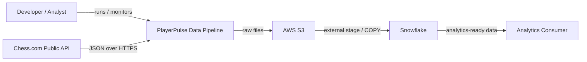
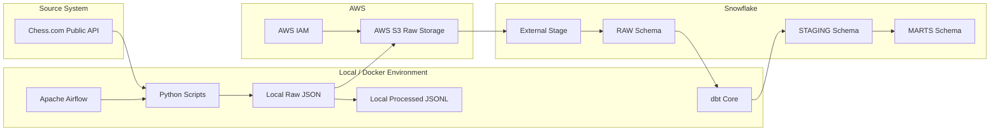
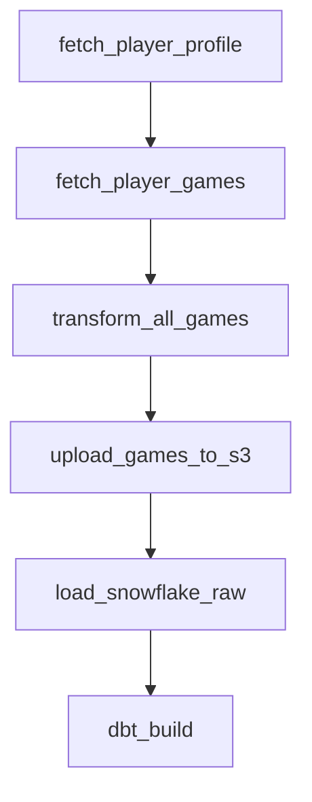
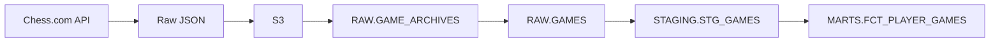
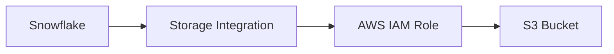
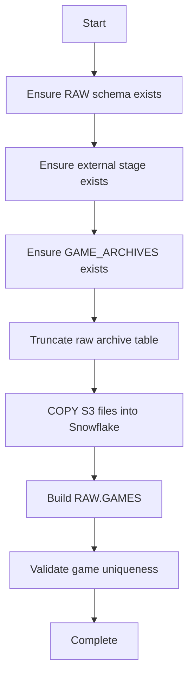
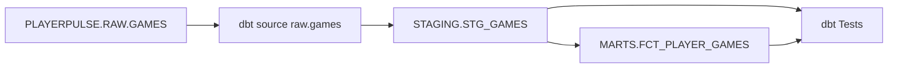
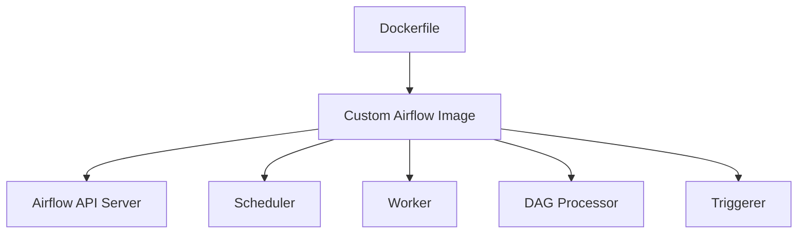
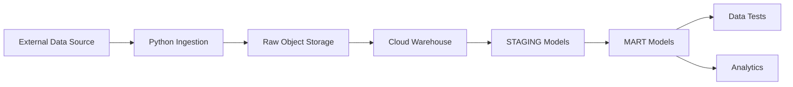

# PlayerPulse Architecture

## 1. Purpose

This document describes the technical architecture of PlayerPulse.

Its goals are to:

- explain how data moves through the platform;
- define the responsibility of each component;
- document important architectural decisions;
- distinguish the current implementation from future improvements;
- provide a reusable reference architecture for future API-driven data engineering projects.

PlayerPulse currently implements the following pattern:

```text
External API
    ↓
Python Ingestion
    ↓
Raw Files
    ↓
Cloud Object Storage
    ↓
Cloud Data Warehouse
    ↓
SQL Transformation
    ↓
Data Quality Tests
    ↓
Analytics-Ready Models
```

The specific source is Chess.com, but the architecture is intentionally designed so the source system could later be replaced.

---

# 2. System Context

At the highest level, PlayerPulse connects an external public API to an analytical warehouse.



The system currently runs from a local Docker environment.

AWS S3 and Snowflake are cloud services.

---

# 3. High-Level Architecture



An important detail is that the locally processed JSONL files are **not currently the source used for the Snowflake load**.

The cloud path uses the raw Chess.com JSON files:

```text
Chess.com API
    ↓
Raw JSON
    ↓
S3
    ↓
Snowflake RAW
```

The local JSONL transformation exists as a separate learning and processing layer.

---

# 4. Control Flow vs Data Flow

One of the most important architectural distinctions in PlayerPulse is the difference between:

```text
control flow
```

and:

```text
data flow
```

## Control flow

Airflow controls **when tasks run**.



Airflow does not itself contain the game data.

It coordinates the programs that process the data.

---

## Data flow

The actual data travels through a different conceptual path:



This distinction matters because an orchestration system and a storage system solve different problems.

---

# 5. Component Responsibilities

| Component | Primary Responsibility | Does Not Replace |
|---|---|---|
| Chess.com API | Expose public source data | Storage or transformation |
| Python | Procedural ingestion and file processing | Workflow orchestration |
| Airflow | Task orchestration and dependency management | Data warehouse |
| Docker | Reproducible runtime environment | Orchestration |
| AWS S3 | Durable raw object storage | Analytical database |
| AWS IAM | Authentication and authorization | Data storage |
| Snowflake | Analytical data storage and SQL compute | Raw object storage |
| dbt | SQL modeling, testing, lineage | Workflow engine |
| Git | Source version control | Data storage |
| GitHub | Repository hosting and collaboration | Runtime infrastructure |

A major design principle is:

> Give each technology a clear responsibility.

---

# 6. Source Layer

## Chess.com Public API

The source system exposes public resources through HTTPS.

Important endpoints include:

```text
/pub/player/{username}

/pub/player/{username}/games/archives

/pub/player/{username}/games/{year}/{month}
```

The source data is JSON.

Example conceptual structure:

```json
{
  "games": [
    {
      "uuid": "...",
      "time_class": "rapid",
      "white": {
        "username": "...",
        "rating": 1200,
        "result": "win"
      },
      "black": {
        "username": "...",
        "rating": 1190,
        "result": "resigned"
      }
    }
  ]
}
```

The ingestion layer preserves this original representation before warehouse modeling.

---

# 7. Python Ingestion Layer

Python is used when procedural logic is required.

Examples include:

- HTTP requests;
- looping over available archives;
- parsing archive URLs;
- reading and writing files;
- retry/error handling;
- S3 SDK calls;
- Snowflake connector calls.

The scripts are separated by responsibility.

```text
scripts/
├── fetch_player_profile.py
├── fetch_player_games.py
├── transform_games.py
├── transform_all_games.py
├── upload_to_s3.py
├── upload_all_to_s3.py
└── load_s3_to_snowflake.py
```

This separation allows individual components to be tested independently.

---

# 8. Archive Discovery

The ingestion process does not assume that every month contains games.

It first requests:

```text
/pub/player/{username}/games/archives
```

The API returns only the archive URLs that actually exist.

The pipeline then loops over those available archives.

Conceptually:

```text
Ask API which archives exist
        ↓
Receive list of URLs
        ↓
Loop through URLs
        ↓
Download each archive
```

This is preferable to blindly generating every year/month combination.

---

# 9. Local Raw Storage

Downloaded API responses are initially written to:

```text
data/raw/
```

Example:

```text
data/raw/ajaza_games_2026_03.json
```

Local raw data is not committed to Git.

Reasons include:

- source data should not unnecessarily inflate the repository;
- raw files can be regenerated;
- code and data have different lifecycle requirements;
- the cloud raw layer is S3.

---

# 10. Local Processing Layer

The project also contains Python logic that converts nested JSON into flattened JSON Lines.

Conceptually:

```text
Nested API JSON
       ↓
Python flattening
       ↓
JSONL
```

Example:

```text
white.username
```

becomes:

```text
white_username
```

The output is written under:

```text
data/processed/
```

## Architectural note

This local transformation currently does not feed Snowflake.

The Snowflake path intentionally starts from the raw JSON stored in S3.

That means PlayerPulse currently demonstrates two transformation approaches:

### File-level transformation

```text
JSON
→ Python
→ JSONL
```

### Warehouse transformation

```text
Raw JSON
→ Snowflake VARIANT
→ SQL/dbt
```

The warehouse-based approach is the primary analytical architecture.

---

# 11. Airflow Orchestration Layer

Apache Airflow is the workflow orchestrator.

Current DAG:

```text
dags/playerpulse_pipeline.py
```

Current execution graph:

```text
fetch_player_profile
        ↓
fetch_player_games
        ↓
transform_all_games
        ↓
upload_games_to_s3
        ↓
load_snowflake_raw
        ↓
dbt_build
```

Airflow provides:

- dependency management;
- task state;
- retries;
- centralized logs;
- manual triggering;
- scheduling capability;
- failure visibility.

---

# 12. Why Airflow Is Separate From Python

The Python scripts are independently executable.

For example:

```bash
python3 scripts/fetch_player_games.py ajaza --all
```

Airflow does not replace this Python code.

Instead, Airflow invokes the scripts and coordinates their order.

Without Airflow:

```text
Developer manually runs command 1
Developer manually runs command 2
Developer manually runs command 3
...
```

With Airflow:

```text
DAG defines dependencies
        ↓
Airflow executes tasks
        ↓
Airflow tracks success/failure
```

This separation improves maintainability and automation.

---

# 13. Raw Cloud Storage

AWS S3 acts as the durable raw storage layer.

Current conceptual structure:

```text
s3://<bucket>/
└── chesscom/
    └── games/
        └── username=ajaza/
            ├── year=2018/
            │   └── month=11/
            │       └── games.json
            │
            └── year=2026/
                ├── month=01/
                │   └── games.json
                └── month=03/
                    └── games.json
```

The path uses partition-style keys:

```text
username=<value>
year=<value>
month=<value>
```

This provides a predictable storage convention.

---

# 14. Why Keep a Raw Layer?

A raw layer provides a stable copy of source data.

If downstream transformation logic changes, the original API response remains available.

Without a raw layer:

```text
API
 ↓
Transformation
 ↓
Final table
```

If the transformation was wrong, the source may need to be downloaded again.

With a raw layer:

```text
API
 ↓
S3 RAW
 ↓
Transformation v1

S3 RAW
 ↓
Transformation v2
```

The same source can be replayed.

---

# 15. AWS Security Boundary

PlayerPulse separates AWS authentication from application source code.

The source repository does not contain AWS secret keys.

For local development:

```text
Host ~/.aws
    ↓ read-only mount
Airflow container
    ↓
AWS SDK / boto3
    ↓
AWS
```

The Docker mount is:

```text
${HOME}/.aws:/home/airflow/.aws:ro
```

The `ro` flag means:

```text
read only
```

The container can use the credentials but cannot modify the host AWS configuration.

---

# 16. IAM Authorization

A dedicated IAM identity is used by the pipeline.

Its permissions are limited to the required S3 operations.

Examples include:

```text
s3:GetBucketLocation
s3:ListBucket
s3:GetObject
s3:PutObject
```

This follows the principle of:

```text
least privilege
```

meaning an application should receive only the permissions required to perform its job.

---

# 17. Snowflake–AWS Trust Relationship

Snowflake accesses S3 through a Storage Integration.

Conceptually:



This avoids embedding an AWS access key directly inside Snowflake.

---

# 18. External Stage

Snowflake uses an external stage to reference the S3 location.

Conceptually:

```text
Snowflake Stage
      ↓
s3://<bucket>/chesscom/
```

A stage is metadata describing where the external files are located and how Snowflake can access them.

The stage is not itself another copy of the source files.

---

# 19. Snowflake Logical Architecture

The database is separated into three logical schemas:

```text
PLAYERPULSE
│
├── RAW
├── STAGING
└── MARTS
```

Each layer has a different purpose.

---

# 20. RAW Layer

The RAW schema keeps data close to its original source form.

Current objects include:

```text
RAW.GAME_ARCHIVES
RAW.GAMES
```

## GAME_ARCHIVES

Each row represents one monthly source file.

Conceptual columns:

```text
SOURCE_FILE
LOADED_AT
PAYLOAD
```

`PAYLOAD` uses Snowflake:

```text
VARIANT
```

which supports semi-structured JSON.

---

# 21. JSON Flattening in Snowflake

A monthly archive contains:

```text
one file
    ↓
games array
    ↓
many game objects
```

Snowflake uses:

```sql
LATERAL FLATTEN
```

to turn the array into one row per game.

Conceptually:

```text
GAME_ARCHIVES

archive_1 → [game1, game2, game3, game4]
archive_2 → [game5]

            ↓ LATERAL FLATTEN

RAW.GAMES

game1
game2
game3
game4
game5
```

This is a common pattern when loading nested JSON into an analytical warehouse.

---

# 22. Snowflake Compute

Snowflake separates:

```text
storage
```

from:

```text
compute
```

The database stores persistent data.

The virtual warehouse executes queries.

Current compute resource:

```text
PLAYERPULSE_WH
```

The warehouse uses a small size and automatic suspension.

This helps reduce unnecessary compute usage.

---

# 23. Snowflake Raw Load Process

The automated loader:

```text
scripts/load_s3_to_snowflake.py
```

performs the following steps:



---

# 24. Current Loading Strategy

The current implementation uses:

```text
full refresh
```

rather than:

```text
incremental loading
```

The raw archive table is cleared and rebuilt from the current S3 contents.

This is appropriate for the current dataset size.

Current sample:

```text
10 games
```

The architecture favors correctness and simplicity before introducing incremental state management.

---

# 25. Idempotency

A key property of the current pipeline is rerunnability.

If the pipeline is run several times against the same source:

```text
Run 1 → 10 games
Run 2 → 10 games
Run 3 → 10 games
```

It should not create:

```text
Run 1 → 10
Run 2 → 20
Run 3 → 30
```

This property is called:

```text
idempotency
```

The current full-refresh implementation provides simple deterministic behavior for the portfolio-sized dataset.

---

# 26. dbt Transformation Architecture

dbt manages warehouse transformations.

Current lineage:



---

# 27. dbt Source Layer

The existing Snowflake object is declared as:

```text
source('raw', 'games')
```

This tells dbt:

- the data already exists outside dbt;
- downstream models depend on it;
- the source should appear in lineage.

This is preferable to repeatedly hard-coding:

```text
PLAYERPULSE.RAW.GAMES
```

inside every model.

---

# 28. STAGING Layer

The staging model is:

```text
STAGING.STG_GAMES
```

Its primary responsibilities are:

- extracting JSON fields;
- applying data types;
- standardizing names;
- performing lightweight cleaning;
- exposing stable source-level columns.

Typical fields include:

```text
game_id
game_url
end_time_utc
time_control
time_class
white_username
white_rating
white_result
black_username
black_rating
black_result
```

The staging layer should generally remain close to the source meaning.

---

# 29. MARTS Layer

The primary current mart is:

```text
MARTS.FCT_PLAYER_GAMES
```

Its purpose is to make analysis easier.

The raw game has two player positions:

```text
white
black
```

But an analyst interested in a specific player usually wants:

```text
player
opponent
```

The mart therefore creates fields such as:

```text
player_username
opponent_username
player_color
player_rating
opponent_rating
player_result
opponent_result
game_outcome
rating_difference
```

This moves repeated analytical logic upstream.

---

# 30. Why MARTS Exist

Without the mart, every downstream analysis might need logic such as:

```text
IF player is white:
    use white_rating
ELSE:
    use black_rating
```

Repeated logic increases the chance that two reports calculate the same metric differently.

The mart centralizes that interpretation.

---

# 31. Data Quality Architecture

Testing occurs after transformations are built.

Current tests validate assumptions including:

```text
game_id is not null
game_id is unique
end_time_utc is not null
time_class is not null
white_username is not null
black_username is not null
player_username is valid
player_color is valid
game_outcome is valid
```

Current dbt result:

```text
PASS=19
WARN=0
ERROR=0
```

---

# 32. Pipeline Success vs Data Correctness

These are not the same concept.

A task can successfully execute SQL such as:

```sql
INSERT ...
```

while still creating incorrect data.

Therefore:

```text
Airflow task success
```

means:

```text
the process executed successfully
```

while:

```text
dbt test success
```

provides additional evidence that:

```text
the resulting data satisfies defined expectations
```

Both are necessary.

---

# 33. Docker Runtime Architecture

PlayerPulse runs Airflow through Docker Compose.

Conceptually:



The custom image includes:

```text
Apache Airflow
dbt-snowflake
Snowflake Python connector dependencies
```

This keeps dbt inside the controlled container environment.

---

# 34. Image vs Container

A Docker image is:

```text
a reusable blueprint
```

A Docker container is:

```text
a running instance of that blueprint
```

Conceptually:

```text
Dockerfile
    ↓ build
Image
    ↓ run
Container
```

This distinction is important when debugging dependencies.

Installing a package on the host machine does not automatically install it inside the Airflow container.

---

# 35. Dependency Management

Different parts of the project currently use different dependency scopes.

Local Python dependencies include:

```text
boto3
```

The Airflow Docker image additionally installs:

```text
dbt-snowflake
```

which also brings the Snowflake connector required by the Snowflake loading script.

The intended long-term goal is to keep dependency definitions explicit and reproducible.

---

# 36. Secrets and Configuration

Secrets must remain outside version control.

Examples include:

```text
AWS credentials
Snowflake password
.env
dbt profiles.yml
```

The repository's `.gitignore` excludes these local resources.

Configuration and code should be treated separately.

Conceptually:

```text
Code
+
Runtime Configuration
+
Secrets
=
Running Application
```

---

# 37. Failure Model

Different failure types can occur at different stages.

| Stage | Example Failure |
|---|---|
| API | Network timeout |
| Python | Invalid JSON |
| Local filesystem | Missing directory |
| S3 | Permission denied |
| Snowflake | Authentication error |
| Snowflake COPY | Invalid source file |
| dbt | SQL compilation failure |
| dbt tests | Duplicate or null data |
| Airflow | Task failure |

Airflow provides the orchestration-level mechanism for surfacing these failures.

---

# 38. Retry Strategy

The Airflow DAG includes retries.

Retries are useful for temporary failures such as:

```text
network interruption
temporary API error
temporary cloud service issue
```

Retries should not hide deterministic problems such as:

```text
invalid SQL
wrong credentials
broken Python syntax
```

Those problems require correction rather than repeated execution.

---

# 39. Observability

Current observability includes:

```text
Airflow task state
Airflow logs
Snowflake query results
dbt test results
row-count validation
uniqueness validation
```

A production system would extend this with:

```text
alerts
metrics
SLAs
data freshness checks
structured logging
external monitoring
```

---

# 40. Current Architecture vs Target Architecture

## Current

```text
Local Docker Airflow
        ↓
Python
        ↓
S3
        ↓
Snowflake
        ↓
dbt
```

Credentials are provided through local configuration.

Snowflake loading uses a full refresh.

The player is partly hard-coded.

---

## Target

```text
Scheduled / Managed Orchestrator
        ↓
Parameterized Ingestion
        ↓
Partitioned S3 Raw Layer
        ↓
Incremental Snowflake Loading
        ↓
dbt Models
        ↓
Automated Tests
        ↓
CI/CD
        ↓
Dashboard / Analytics
```

The target architecture would also include:

```text
least-privilege Snowflake roles
short-lived cloud credentials
monitoring
alerting
source freshness
incremental state management
CI validation
```

---

# 41. Current Security Limitations

The project already avoids committing secrets, but several improvements remain.

## Snowflake role

The current development configuration uses a highly privileged role.

A more mature architecture should introduce roles such as:

```text
PLAYERPULSE_LOADER
PLAYERPULSE_TRANSFORMER
PLAYERPULSE_READER
```

with separate privileges.

---

## AWS local credentials

The local Docker environment reads AWS credentials from the host.

This works for development.

Production workloads should preferably use workload identities and temporary credentials.

---

# 42. Current Scalability Limitations

The architecture works for the current dataset, but some decisions are deliberately optimized for learning rather than scale.

Examples:

```text
full refresh Snowflake loading
small number of archives
single-player analytical mart
local Airflow deployment
```

These are known limitations rather than hidden assumptions.

---

# 43. Incremental Loading — Future Design

The most important future data engineering improvement is incremental ingestion.

Instead of:

```text
TRUNCATE
↓
reload everything
```

the system could track which archives have already been loaded.

Example:

```text
S3 files
   ↓
Compare against ingestion metadata
   ↓
Load only unseen files
   ↓
MERGE into target
```

Possible metadata:

```text
source_file
file_last_modified
loaded_at
row_count
load_status
```

---

# 44. Future Product Event Architecture

PlayerPulse is planned to expand beyond public game data.

A synthetic product-event stream could follow:

```text
Product Events
      ↓
Python Generator
      ↓
S3
      ↓
Snowflake RAW.EVENTS
      ↓
dbt STAGING
      ↓
Sessions
      ↓
Funnels
      ↓
Cohorts
      ↓
Retention
      ↓
Churn
```

This would reuse the same infrastructure while introducing product analytics concepts.

---

# 45. Template Architecture

PlayerPulse can be generalized into the following reusable pattern:



---

# 46. What Changes Between Projects?

The reusable infrastructure can stay similar.

The source-specific logic changes.

For another API project:

```text
Keep:
Airflow
Docker
S3 pattern
Snowflake structure
dbt structure
testing pattern
Git workflow

Replace:
API client
source-specific fields
raw table definitions
staging model
business marts
business tests
```

This is why PlayerPulse can serve as a personal data engineering template.

---

# 47. Architectural Principles

PlayerPulse follows several principles.

## Preserve raw source data

Do not destroy the original representation too early.

## Separate responsibilities

Use each tool for the problem it solves best.

## Make pipelines rerunnable

Repeated execution should not silently corrupt data.

## Test data, not only code

Successful execution does not guarantee correct output.

## Keep secrets outside Git

Configuration and credentials must be separated from source code.

## Prefer reproducibility

Another environment should be able to recreate the platform.

## Start simple

Do not introduce distributed-system complexity before the scale requires it.

## Document limitations

A portfolio project is more credible when its limitations are explicit.

---

# 48. Architecture Summary

The current end-to-end architecture is:

```text
Chess.com Public API
        ↓
Python ingestion
        ↓
Raw JSON files
        ↓
Apache Airflow orchestration
        ↓
AWS S3
        ↓
Snowflake Storage Integration
        ↓
Snowflake RAW
        ↓
dbt STAGING
        ↓
dbt MARTS
        ↓
dbt data quality tests
        ↓
Analytics-ready data
```

The most important architectural lesson from PlayerPulse is not any individual technology.

It is understanding the separation between:

```text
ingestion
orchestration
storage
compute
transformation
testing
security
analytics
```

and how those layers work together as one data platform.
